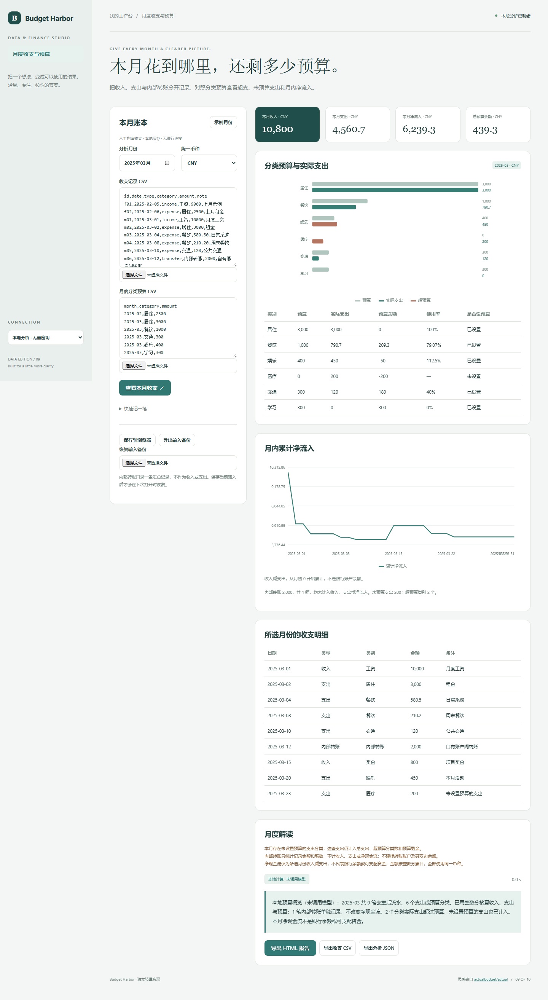

# Budget Harbor

把收入、支出与内部转账分开记录，对照分类预算查看超支、未预算支出和月内净流入。

- 按月筛选收入、支出和分类预算
- 内部转账独立统计，不虚增收支
- 整数分计算与记录 ID 重复保护
- 快速录入、浏览器保存、JSON备份恢复及报告导出



## 快速开始

需要 Node.js 24 或更新版本；无第三方运行依赖，无需 npm install。

```sh
git clone https://github.com/Yiwen-Yang-BA/chatgpt-budget-harbor.git
cd chatgpt-budget-harbor
npm start
```

打开 http://127.0.0.1:3209 。默认进入**本地分析模式**，不调用 API；统计值由本地代码计算。示例数据为人工构造，界面明确标注。

### 接入真实模型

复制 `.env.example` 为 `.env`，填写 `OPENAI_API_KEY`，按账号权限设置 `OPENAI_MODEL`，然后重启服务并切换界面中的「AI 解读」。`OPENAI_BASE_URL` 必须支持 OpenAI Responses API；仅兼容 Chat Completions 的服务不适用。密钥只在服务端读取，不写入前端或仓库。

```sh
# Docker（可选；必须显式传入配置）
docker build -t chatgpt-budget-harbor .
docker run --rm -p 127.0.0.1:3209:3209 --env-file .env chatgpt-budget-harbor
```

## 使用方法

1. 收支 CSV 使用 id,date,type,category,amount,note；type 为 income/expense/transfer，每条记录有唯一 ID。
2. 预算 CSV 使用 month,category,amount，为指定月份设置支出类别上限。
3. 金额为正的普通十进制数，最多两位小数；预算金额允许零。
4. 选择月份分析，可快速录入、保存到浏览器或导出完整输入备份。

## 计算口径

每笔金额先精确转换为整数分再求和，不用浮点小数累加收支。最多两位小数，每笔不超过1e9元，累计金额不超过1e12元；负数、科学计数和千分分隔符拒绝。月度净流入=收入−支出；内部转账仅单列金额和笔数，收入/支出/净流入均不含转账。预算余额=分类预算−本月分类支出；未预算类别以预算0计，预算为0时使用率未定义。总预算余额=总预算−全部支出，可能为负；它不是银行余额。累计净流入从当月0开始，不是账户余额。相同记录ID及全部字段完全一致时去重，ID相同但内容不同则拒绝。预算同月同类别不能重复。单一币种、无跨月预算滚存、无退款/债务/账户双边核销，不复刻完整信封预算系统。

## 验证

```sh
npm run check
npm test
```

测试覆盖业务规则以及本地 HTTP 服务、模拟模型接口、输入校验和错误处理。真实付费模型调用需要用户配置有效密钥，未将本地分析测试作为真实模型质量验证。GitHub Actions 在每次推送时运行检查。

## 参考与复刻范围

灵感来自 [actualbudget/actual](https://github.com/actualbudget/actual)（MIT）。查询快照：2026-10-04；29,280 stars；最近推送 2026-10-03。这是当前星标量与更新状态，**不是近一个月新增星标排名**。

本仓库是对其核心交互和用途的独立轻量实现，未复制上游源码、商标或静态资源，不声称实现上游的全部功能，也不属于上游官方产品。

独立复刻月度分类预算、手动收支和现金流概览，区分收入、支出与内部转账，保留预算实际差额并支持本地备份及 CSV 导入导出。使用示例或用户自愿录入的数据，不要求银行账户，不提供银行同步、贷款审批或多币种自动换算。

## 模型接收的数据

模型仅接收选择月份、币种、月度汇总和分类预算统计，不发送交易ID、日期明细或备注。

## 数据与部署边界

点击保存后，当前输入保存在本浏览器；JSON输入备份可恢复原始数据。不会连接银行或同步第三方账户。 本地分析数据不离开本机；AI 解读仅发送本项目 README 说明的统计摘要到所配置的模型服务。

默认只监听 127.0.0.1，适用于单人本地使用；没有多用户登录或持久数据库。如需公网部署，请先增加身份验证、配额和 HTTPS。服务限制请求大小、并发和超时，禁止从静态目录读取密钥文件。

接口实现依据 [OpenAI 官方文本生成文档](https://developers.openai.com/api/docs/guides/text)。

## License

MIT — independent implementation.
